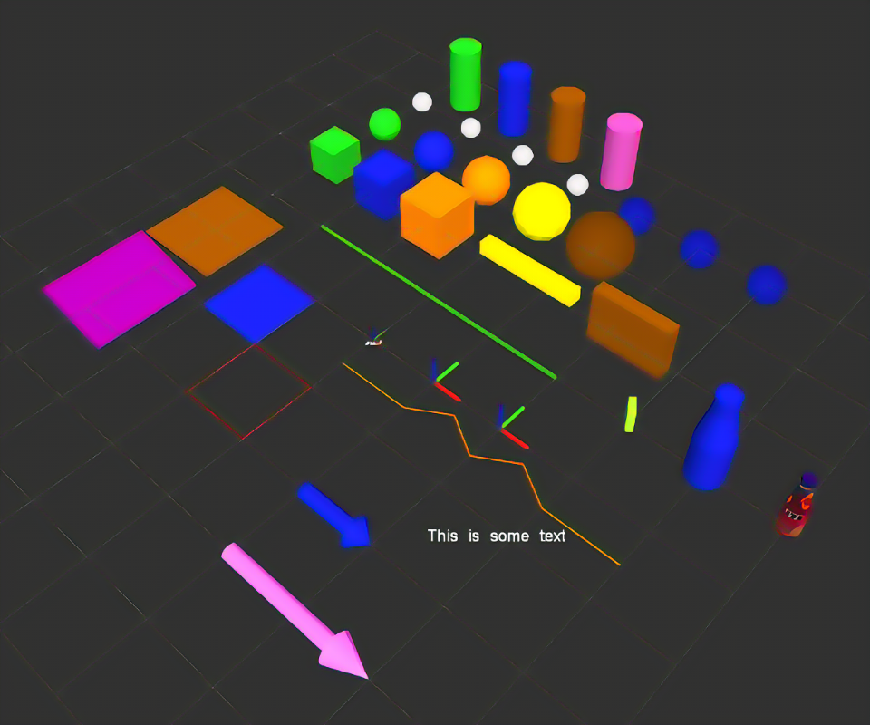

# rttviz-lvgl

In ADAS, ROS is popular middleware for startup. It ROS community, Rviz is used for visualization and simulation, but Rviz is one QT based application only work on Linux machine, mainly following ROS Ubuntu release.
[](site/R-C.png)
This is ROS 3D element used to build simulation world, Rvizs idea is that it provide you lots of basic geometry elements, like cube, ball, line, cylinder and etc. then just like playing LEGO building blocks. 

This project trying to build a quivalent embeded GUI for Rviz, so that in real project, all defined ROS communication can be reused, add one more piece of embeded GUI screen, a fast prototype can be done.

[](figures/Archetecture.png)


# Main component

# Communication hub
In RViz, each visualizable element has its backend ROS message definiation, for example, all above geometry elements are ROS visualization/Marker types.
So the communication hub, i.e. rttviz_ros_bridge, is working on ROS computer side, subscribe all visualizable elements and republish them to bus, typically, CAN / SPI / IIC / TTL / ETH. the republished messages are plain human readable json configurations.

```json
{
	"type":"Marker.CUBE / Marker.LINE_STRIP/ ... ...",
	"dim":[300, 400, 500],
	"pos":[0, 0, 0, 0, 0, 0],
	"frame_id":"local_map"
}
```

# Line draw style 3D
rttviz extends LVGL canvas(2D), make one leightweight line style 3D world in it, rather than real beautiful 3D with texture rendering and complex surface. I am focus on embeded chip, so not real 3D.

# 3D shapes lib
This is the main task of rttviz, base on the Line draw style 3D, all basical 3D shape shall be implemented inside embeded board via rt-thread+LVGL.